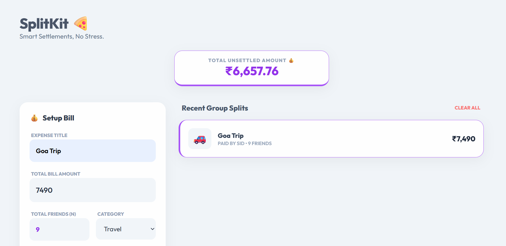

# 💗 Split Kit – Cute Expense Splitter

A simple and adorable web app that helps friends or couples split expenses easily.  
Add expenses, track who paid, and instantly see who owes whom — all in a soft pink pastel themed interface.

---

## ✨ Features

• Add expense amount and payer  
• Automatically calculates **who owes whom**  
• Shows **running balance** between friends  
• Stores history using **Local Storage**  
• **Clear History** button to reset everything  
• **WhatsApp share** option to quickly send the balance  
• Soft **pink pastel aesthetic UI**

---

## 🛠 Tech Stack

• HTML  
• CSS  
• JavaScript  
• Local Storage API

---

## 🎨 UI Preview

  
  

---

## 🚀 How to Use

1. Enter the **expense amount**
2. Select **who paid**
3. Add the expense
4. The app will automatically show **who owes whom**

---
## 🌐 Live Demo

🚀 **Try the app here:**  
[Open SplitKit](https://vaishnavilalan106.github.io/Split_Kit/)

---

## 👩‍💻 Author

Made with 💗 by **Vaishnavi L**

• GitHub: https://github.com/VaishnaviLalan106

---

## ⭐ Support

If you like this project, consider giving it a ⭐ on GitHub!
